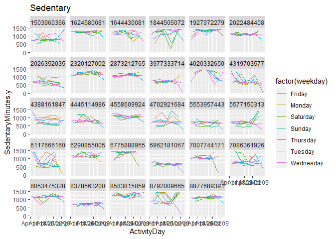

Fitness_Data_analysis
================
Joonseop So
2023-09-15

## Fitness Data Analysis in .rmd

A dataset was provided with health and fitness data from over 25
individuals. This is a analysis on trends and future take for business
owners to improve sales or better marketing.

But first, we need to read and install all the packages and libraries
and csv files. packages to be installed:

install.packages(“dplyr”) install.packages(“corrplot”)
install.packages(“gghighlight”) install.packages(“tidyverse”)

``` r
library(dplyr)
library(readr)
library(tidyverse)
library(lubridate)
library(ggplot2)
library(corrplot)
library(gghighlight)
sleepDay_merged <- read_csv("Fitness_dataset/sleepDay_merged.csv")
sleepDay_merged <- sleepDay_merged %>% rename(ActivityDay = SleepDay)
weightLogInfo_merged <- read_csv("Fitness_dataset/weightLogInfo_merged.csv")
dailyActivity_merged <- read_csv("Fitness_dataset/dailyActivity_merged.csv")
dailyActivity_merged <- dailyActivity_merged %>% rename(ActivityDay = ActivityDate)
dailyCalories_merged <- read_csv("Fitness_dataset/dailyCalories_merged.csv")
dailyIntensities_merged <- read_csv("Fitness_dataset/dailyIntensities_merged.csv")
```

### Note

I also changed the name of some columns to make merging every dataset
into 1 dataframe easier.

## Merging the dataframe and adding weekdays

``` r
day_data <- merge(x=dailyActivity_merged, y=dailyIntensities_merged,  by.x = c("ActivityDay","Id"),by.y = c("ActivityDay", "Id"))
day_data$ActivityDay <- as.Date(day_data$ActivityDay, format = "%m/%d/%Y")
sleepDay_merged$ActivityDay <- as.Date(sleepDay_merged$ActivityDay, format = "%m/%d/%Y %H:%M:%S AM")
day_data_sleep <- merge(x=day_data, y=sleepDay_merged,  by.x = c("ActivityDay","Id"),by.y = c("ActivityDay", "Id"))
day_data_sleep$weekday <- wday(day_data_sleep$ActivityDay)
day_data_sleep$weekday <- recode(day_data_sleep$weekday, 
                        "1"="Sunday",
                        "2"="Monday",
                        "3"="Tuesday",
                        "4"="Wednesday",
                        "5"="Thursday",
                        "6"="Friday",
                        "7"="Saturday")
day_data$weekday <- wday(day_data$ActivityDay)
day_data$weekday <- recode(day_data$weekday, 
                        "1"="Sunday",
                        "2"="Monday",
                        "3"="Tuesday",
                        "4"="Wednesday",
                        "5"="Thursday",
                        "6"="Friday",
                        "7"="Saturday")
head(day_data)
```

    ##   ActivityDay         Id TotalSteps TotalDistance TrackerDistance
    ## 1  2016-04-12 1503960366      13162          8.50            8.50
    ## 2  2016-04-12 1624580081       8163          5.31            5.31
    ## 3  2016-04-12 1644430081      10694          7.77            7.77
    ## 4  2016-04-12 1844505072       6697          4.43            4.43
    ## 5  2016-04-12 1927972279        678          0.47            0.47
    ## 6  2016-04-12 2022484408      11875          8.34            8.34
    ##   LoggedActivitiesDistance VeryActiveDistance.x ModeratelyActiveDistance.x
    ## 1                        0                 1.88                       0.55
    ## 2                        0                 0.00                       0.00
    ## 3                        0                 0.14                       2.30
    ## 4                        0                 0.00                       0.00
    ## 5                        0                 0.00                       0.00
    ## 6                        0                 3.31                       0.77
    ##   LightActiveDistance.x SedentaryActiveDistance.x VeryActiveMinutes.x
    ## 1                  6.06                         0                  25
    ## 2                  5.31                         0                   0
    ## 3                  5.33                         0                   2
    ## 4                  4.43                         0                   0
    ## 5                  0.47                         0                   0
    ## 6                  4.26                         0                  42
    ##   FairlyActiveMinutes.x LightlyActiveMinutes.x SedentaryMinutes.x Calories
    ## 1                    13                    328                728     1985
    ## 2                     0                    146               1294     1432
    ## 3                    51                    256               1131     3199
    ## 4                     0                    339               1101     2030
    ## 5                     0                     55                734     2220
    ## 6                    14                    227               1157     2390
    ##   SedentaryMinutes.y LightlyActiveMinutes.y FairlyActiveMinutes.y
    ## 1                728                    328                    13
    ## 2               1294                    146                     0
    ## 3               1131                    256                    51
    ## 4               1101                    339                     0
    ## 5                734                     55                     0
    ## 6               1157                    227                    14
    ##   VeryActiveMinutes.y SedentaryActiveDistance.y LightActiveDistance.y
    ## 1                  25                         0                  6.06
    ## 2                   0                         0                  5.31
    ## 3                   2                         0                  5.33
    ## 4                   0                         0                  4.43
    ## 5                   0                         0                  0.47
    ## 6                  42                         0                  4.26
    ##   ModeratelyActiveDistance.y VeryActiveDistance.y weekday
    ## 1                       0.55                 1.88 Tuesday
    ## 2                       0.00                 0.00 Tuesday
    ## 3                       2.30                 0.14 Tuesday
    ## 4                       0.00                 0.00 Tuesday
    ## 5                       0.00                 0.00 Tuesday
    ## 6                       0.77                 3.31 Tuesday

## Clean the data for missing values and errors

``` r
day_data <- Filter(Negate(is.null), day_data)
day_data_sleep <- Filter(Negate(is.null), day_data_sleep)
```

## First analysis with correlation matrix

``` r
data_cor <- subset(day_data_sleep, select = -c(ActivityDay, Id, weekday))
cor <- cor(data_cor)
corrplot(cor, type = "upper", order = "hclust", 
         tl.col = "black", tl.srt = 45)
```

<!-- -->

### Note

The matrix shows overall negative correlation of sleep with any kind of
activity. Also higher correlation of Steps and Distance to ´very activ
activity.

## Plotting of different kind of activity dependent on weekday

``` r
ggplot(day_data , aes(x=ActivityDay, y=LightlyActiveMinutes.y , color = factor(weekday)))+ geom_line(aes(group = weekday), size =0.5)+facet_wrap(~Id)
```

    ## Warning: Using `size` aesthetic for lines was deprecated in ggplot2 3.4.0.
    ## ℹ Please use `linewidth` instead.
    ## This warning is displayed once every 8 hours.
    ## Call `lifecycle::last_lifecycle_warnings()` to see where this warning was
    ## generated.

    ## `geom_line()`: Each group consists of only one observation.
    ## ℹ Do you need to adjust the group aesthetic?

<!-- -->

``` r
ggplot(day_data , aes(x=ActivityDay, y=LightlyActiveMinutes.y , fill = factor(weekday)))+ geom_col(aes(group = weekday), size =0.5)+facet_wrap(~Id)
```

<!-- -->

### Note

As we can see some plots are missing or are incomplete. Thats an
indicator for not doing the exercise or error. The uncompleted plots are
results of discontinuing the exercise. <br> I will remove the incomplete
plots for better analysis

``` r
day_data<- filter(day_data, Id !="4057192912"& Id!="2347167796"& Id!="3372868164"& Id!="8253242879")

ggplot(day_data , aes(x=ActivityDay, y=LightlyActiveMinutes.y , color = factor(weekday)))+ geom_line(aes(group = weekday), size =0.5)+facet_wrap(~Id)
```

<!-- -->

#### What trends are visible?

To see some trends lets compare the plots of each different kind of
activity.

``` r
ggplot(day_data , aes(x=ActivityDay, y=SedentaryMinutes.y , color = factor(weekday)))+ geom_line(aes(group = weekday), size =0.5)+facet_wrap(~Id)+ggtitle("Sedentary")
```

<!-- -->

``` r
ggplot(day_data , aes(x=ActivityDay, y=LightlyActiveMinutes.y , color = factor(weekday)))+ geom_line(aes(group = weekday), size =0.5)+facet_wrap(~Id)+ggtitle("Lightly Active")
```

<!-- -->

``` r
ggplot(day_data , aes(x=ActivityDay, y=FairlyActiveMinutes.y , color = factor(weekday)))+ geom_line(aes(group = weekday), size =0.5)+facet_wrap(~Id)+ggtitle("Fairly Active")
```

<!-- -->

``` r
ggplot(day_data , aes(x=ActivityDay, y=VeryActiveMinutes.y , color = factor(weekday)))+ geom_line(aes(group = weekday), size =0.5)+facet_wrap(~Id)+ggtitle("Very Active")
```

<!-- -->

``` r
ggplot(day_data_sleep , aes(x=ActivityDay, y=TotalMinutesAsleep , fill = factor(Id)))+ geom_col(aes(group = Id), size =1)+facet_wrap(~Id)+ggtitle("Sleeping hours")
```

<!-- -->
<br> In every plot we see different type of people and their activity
behavior. If every line in a plot is close to each other and shows a
similar trend (straight line horizontally), this means that this
individual has regular workouts or activities. <br> High fluctuations
means spontaneous activities. <br> If a specific color is abnormally
high: This individual has a certain day to train or do exercise. <br>
The first plot shows the sedentary time an individual has at the same
day. Due to negative correlation shown in the matrix before the plots
also shows a horizontal mirroring to the second plot which indicates the
lightly active minutes of an individual. <br> <br> Overall the trend
shows that higher intensity training is less popular and through out the
time-interval people tend to train less than the beginning. We see an
overall downtrend due to lack of perseverance <br> <br> Especially
Thursdays seems to be the day where most people don’t exercise intensely
while Wednesday is the day where mos people don’t exercise lightly.

``` r
df1<- day_data %>%
  group_by(weekday) %>%
  summarise_at(vars(LightlyActiveMinutes.y,FairlyActiveMinutes.y, VeryActiveMinutes.y), list(name = mean))
df1
```

    ## # A tibble: 7 × 4
    ##   weekday   LightlyActiveMinutes…¹ FairlyActiveMinutes.…² VeryActiveMinutes.y_…³
    ##   <chr>                      <dbl>                  <dbl>                  <dbl>
    ## 1 Friday                      206.                   12.5                   21.5
    ## 2 Monday                      189.                   13.8                   23.7
    ## 3 Saturday                    205.                   14.6                   22.0
    ## 4 Sunday                      170.                   15.2                   20.3
    ## 5 Thursday                    184.                   11.7                   19.8
    ## 6 Tuesday                     194.                   15.1                   23.8
    ## 7 Wednesday                   187.                   13.0                   20.9
    ## # ℹ abbreviated names: ¹​LightlyActiveMinutes.y_name,
    ## #   ²​FairlyActiveMinutes.y_name, ³​VeryActiveMinutes.y_name

``` r
ggplot(day_data , aes(x=ActivityDay, y=LightlyActiveMinutes.y , color = factor(weekday)))+ geom_line(aes(group = weekday), size =0.5)+facet_wrap(~Id)+gghighlight(weekday=="Wednesday")+ggtitle("Lightly Active, Highlight Wednesday")
```

    ## label_key: weekday

<!-- -->

``` r
ggplot(day_data , aes(x=ActivityDay, y=VeryActiveMinutes.y , color = factor(weekday)))+ geom_line(aes(group = weekday), size =0.5)+facet_wrap(~Id)+gghighlight(weekday=="Thursday")+ggtitle("Very Active, Highlight Thursday")
```

    ## label_key: weekday

<!-- -->

``` r
ggplot(day_data , aes(x=ActivityDay, y=FairlyActiveMinutes.y , color = factor(weekday)))+ geom_line(aes(group = weekday), size =0.5)+facet_wrap(~Id)+gghighlight(weekday=="Thursday")+ggtitle("Fairly Active, Highlight Thursday")
```

    ## label_key: weekday

<!-- -->

## Takeaway

The key takeaway from this analysis is that people do buy fitness
gadgets not to track their accomplishments but rather for different
reasons. As shown in the plots only a fraction of people are using this
device for high intensity active training.<br> The majority are using
this for fashionable or other reasons. <br> If this company want to
target high active customers, then there need to be a new approach on
marketing this device. Or the integration of an reward system for very
active Users. If the company want to target the general public, then new
accessorizes such as new wrist bands or customizable device UIs should
attract new Users.
